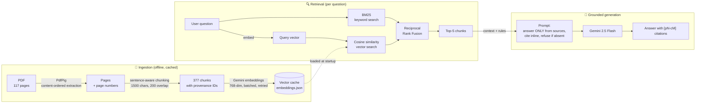

# Fintech RAG — Grounded Q&A over Financial Documents

A production-style **Retrieval-Augmented Generation (RAG)** system built in **C# / .NET 8** that answers natural-language questions about JPMorgan's 2025 Management's Discussion & Analysis (a 117-page SEC filing) — with **inline page citations**, **hybrid retrieval** (semantic + keyword search), and **honest refusal** when the document doesn't contain the answer.

**Stack:** .NET 8 · Semantic Kernel · Google Gemini (chat + embeddings) · PdfPig · BM25 · Reciprocal Rank Fusion

---

## Why this exists

Large language models don't know your documents. Asked *"What were JPMorgan's credit losses in 2025?"*, a frontier LLM answered:

> *"JPMorgan's actual credit losses for 2025 are not available yet... 2025 is in the future."*

The answer was sitting in a public SEC filing the whole time. RAG fixes this: retrieve the relevant passages from the document first, then have the model answer **only from those passages**, citing where each claim came from.

**Before/after, same question:**

| | Answer |
|---|---|
| Plain LLM | "2025 is in the future" ❌ |
| This system | "The firmwide provision for credit losses for full year 2025 was $14,212 million **[p10-c0]**" ✅ |

<!-- SCREENSHOT 1: docs/images/before-after.png — side-by-side or stacked terminal shots of the plain-LLM wrong answer and the grounded cited answer -->


---

## Architecture



### The pipeline in plain language

1. **Extract** — PdfPig pulls text from the PDF page by page. We use its `ContentOrderTextExtractor` (not naive extraction) because financial filings are full of tables; naive extraction fused `2025 2024 2023` into `202520242023` and detached numbers from labels. Page numbers are preserved from the very first step — they power citations at the very last step.

2. **Chunk** — You can't embed 117 pages as one vector (meaning averages into mush) or single sentences (no context). Pages are split into ~1,500-character chunks that prefer to break at sentence boundaries, with 200 characters of overlap so an idea straddling a boundary survives whole in at least one chunk. Each chunk carries an ID like `p87-c1` (page 87, chunk 1) — its provenance.

3. **Embed** — Each chunk is converted to a 768-dimensional vector by `gemini-embedding-001`. Texts with similar *meaning* get numerically similar vectors, even with zero shared words. Embeddings are computed once and cached locally; unchanged content is never re-embedded.

4. **Retrieve (hybrid)** — The question is embedded and compared to all 377 chunk vectors by cosine similarity (semantic search), while BM25 scores chunks by keyword relevance in parallel. The two ranked lists are merged with Reciprocal Rank Fusion. Why both? See the next section — each method has a blind spot the other covers.

5. **Generate (grounded)** — The top chunks are injected into a prompt with three rules: answer **only** from the provided excerpts, cite each claim inline like `[p87-c0]`, and if the excerpts don't contain the answer, say exactly that instead of guessing. The refusal rule is the anti-hallucination guardrail.

---

## Why hybrid retrieval: a real example from this document

The same query, run through both methods:

**Query: "How much did the bank lose to bad loans?"** *(informal wording — none of these words appear in the filing's vocabulary)*

| Rank | Semantic (vector) results | BM25 (keyword) results |
|---|---|---|
| 1 | ✅ Allowance for credit losses (p87) | ❌ Conduct Risk Management (p108) |
| 2 | ✅ Total allowance for loan losses (p87) | ❌ Macroeconomic variables (p111) |
| 3 | ⚠️ Loan maturities / interest rates (p82) | ❌ Customer reward points (p114) |

Semantic search understood that "lose to bad loans" *means* "credit losses." BM25 matched scattered literal words ("bank", "loans") and returned noise.

Flip the query to exact document vocabulary — **"provision for credit losses"** — and BM25 pins the precise chunks while semantic search returns the general neighborhood. Embeddings match **meaning**; BM25 matches **strings** (exact terms, identifiers, rare words). Hybrid search runs both and fuses the rankings so each covers the other's blind spot.

<!-- SCREENSHOT 2: docs/images/hybrid-comparison.png — terminal shot showing Semantic vs BM25 vs Hybrid result lists for the "bad loans" query -->


**Fusion:** Reciprocal Rank Fusion scores each chunk as `Σ 1/(60 + rank)` across both lists. Rank-based fusion sidesteps the fact that cosine scores (~0.67) and BM25 scores (~4.7) live on incomparable scales, and rewards chunks that *both* methods rank well.

---

## Sample session

<!-- SCREENSHOT 3: docs/images/grounded-qa.png — terminal shot with the $14,212 million cited answer AND the CEO-salary refusal -->


```
You: What was the firmwide provision for credit losses for full year 2025?

AI: The firmwide provision for credit losses for full year 2025 was
$14,212 million [p10-c0]. This is also stated as $14.2 billion [p10-c0, p5-c0].

You: What is JPMorgan's CEO's salary?

AI: The retrieved sections don't contain this information.
```

The second exchange matters as much as the first: executive compensation isn't in an MD&A, and the system **refuses rather than fabricates**.

---

## Engineering decisions & challenges

Real problems hit during the build, and how each was handled:

### 1. Financial tables scramble under naive PDF extraction
First extraction pass produced `"202520242023Selected income statement dataTotal net revenue$ 182,447 $ ,556"` — a three-column table flattened into soup. Switching to PdfPig's `ContentOrderTextExtractor` (layout-aware reading order + paragraph breaks) restored usable structure. Tables remain the hardest part of document AI; this is mitigation, not a full solution.

### 2. The embedding model was deprecated mid-build
The original model (`text-embedding-004`) was retired by Google in January 2026 — the API returned 404 on a documented endpoint. Migrated to `gemini-embedding-001` with `outputDimensionality = 768` (it defaults to 3,072; Matryoshka-trained models truncate with minimal quality loss, and 768 dims = ¼ the storage and compute).
**Lesson: embedding models are versioned dependencies with expiry dates.** If cached vectors and query vectors ever come from different models, retrieval breaks *silently* — they live in different vector spaces.

### 3. Free-tier rate limiting (HTTP 429)
Batch embedding 377 chunks tripped requests-per-minute limits. Fixes: smaller batches (25), **exponential backoff** on 429 (5s → 10s → 20s → 40s, capped retries), gentle pacing between batches, and a local JSON cache so embedding is a one-time cost. The terminal log of the run shows the backoff recovering from three throttle events mid-job — the system finished all 377 chunks unattended.

<!-- SCREENSHOT 4 (optional): docs/images/backoff.png — terminal shot of the 429/retry/backoff sequence completing 377/377 -->

### 4. Rank fusion can tie a relevant and an irrelevant chunk
When the two retrieval methods completely disagree (each puts a different chunk at #1, with no overlap), RRF scores them identically — it has no way to know one method's opinion was noise. Current mitigation: retrieve top-5 and let the grounded prompt filter. The principled fix (weighted fusion or a reranker) requires *measurement*, not intuition — which is exactly what the companion eval-harness project provides.

### 5. Known limitation: granularity confusion (found via manual QA)
Asked *"What were JPMorgan's credit losses in 2025?"*, the system answered **"$11.5 billion [p23-c2]"** — a valid citation of a true number... for the **consumer segment only**. The firmwide total is **$14.2 billion**. Retrieval surfaced a true-but-partial context; generation over-generalized it. A precision-forced query ("firmwide... full year 2025") returns the correct figure.

This failure mode — *cited, plausible, wrong aggregation level* — is the most dangerous kind: it can't be caught by demos, only by systematic evaluation against questions with known answers.
---

## Project structure

```
fintech-rag/
├── data/                          # gitignored: source PDF + embedding cache
│   ├── annual-report.pdf          # JPMorgan 2025 MD&A (download separately)
│   └── embeddings.json            # 377 × 768-dim vectors, generated on first run
├── FintechRag.Console/
│   ├── Ingestion/
│   │   ├── DocumentLoader.cs      # PdfPig extraction, page-level, content-ordered
│   │   └── TextChunker.cs         # sentence-aware chunking with overlap
│   ├── Embeddings/
│   │   └── GeminiEmbeddingClient.cs  # batched embedding + 429 backoff + cache
│   ├── Retrieval/
│   │   ├── VectorStore.cs         # in-memory cosine similarity search
│   │   ├── Bm25Index.cs           # TF-IDF-family keyword scoring
│   │   └── HybridSearcher.cs      # Reciprocal Rank Fusion
│   └── Program.cs                 # pipeline assembly + grounded chat loop
└── FintechRag.sln
```

Design note: retrieval is intentionally **in-memory** — 377 × 768 floats is ~1 MB. A vector database (pgvector, Azure AI Search) earns its complexity at millions of vectors, not hundreds. The `VectorStore` interface is the seam where one would slot in.

---

## Run it

**Prerequisites:** .NET 8 SDK · a free [Google AI Studio](https://aistudio.google.com) API key

```bash
git clone https://github.com/Reshma-Shaik1996/fintech-rag.git
cd fintech-rag

# API key via user secrets — never in code, never in the repo
cd FintechRag.Console
dotnet user-secrets init
dotnet user-secrets set "Gemini:ApiKey" "<your-key>"
cd ..

# Document: download JPMorgan's 2025 MD&A from jpmorganchase.com → Investor Relations
# → Annual Report, and save as:
#   data/annual-report.pdf

dotnet run --project FintechRag.Console
```

First run embeds ~377 chunks in rate-limited batches (a few minutes on the free tier); every run after that loads the cache and starts instantly.
